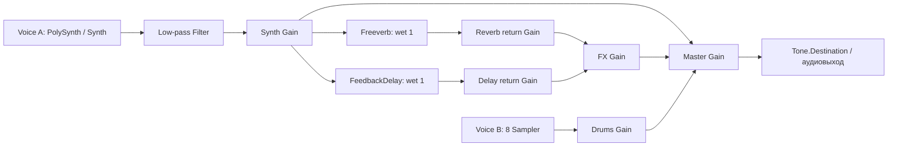

# DUOTONE MINI

**Two voices. One instrument.**

## 01 — Обзор

DUOTONE MINI — браузерный музыкальный инструмент с двумя независимыми звуковыми слоями: полифоническим синтезатором и восемью сэмплерными пэдами. На одной панели можно играть мелодию и аккорды, запускать ритм, импортировать MIDI и менять характер звука во время исполнения.

Учебный проект для просмотра в НИУ ВШЭ объединяет UX/UI-дизайн и creative coding. Интерфейс отсылает к компактному аппаратному контроллеру, а звук создаётся средствами Tone.js в браузере.

[GitHub](https://github.com/matveyabramov/duotone-mini) · [Figma — исходный фрейм](https://www.figma.com/design/KXUjSvnHLI06RCqXclXBwo/Synth?node-id=0-3) · [Performance Screencast — материалы](#glass-horizon-video)

**Live Demo — `TODO: LIVE_DEMO_URL`.** При проверке 8 октября 2026 года стандартный адрес GitHub Pages `https://matveyabramov.github.io/duotone-mini/` вернул HTTP 404. Рабочая публикация пока не подтверждена.

> **Финальный интерфейс**
>
> `TODO: MAIN_SCREENSHOT` — добавить здесь один крупный скриншот итогового интерфейса из единственного основного экрана Figma. Это место для главного визуала кейса; дополнительные экраны не требуются.

<!-- TODO: MAIN_SCREENSHOT — после добавления реального файла вставить Markdown-изображение с существующим относительным путём. -->

## 02 — Концепция инструмента

В основе DUOTONE MINI — сочетание двух разных способов исполнения. Клавиатура задаёт высоту, гармонию и длительность нот; пэды добавляют отдельные ударные события и ритмические акценты. Разделение на Voice A и Voice B позволяет менять тембр мелодии, сохраняя характер барабанов, и управлять балансом обоих слоёв в общем миксе.

Визуальный ориентир — компактные аппаратные MIDI-контроллеры, особенно Arturia MiniLab 3. Проект переносит в браузер их логику расположения: клавиатура внизу, пэды и поворотные регуляторы над ней, небольшой дисплей и блок исполнения рядом. Это интерпретация аппаратной эстетики, а не точная копия устройства.

Светлый корпус, разделительные швы, тени и короткие подписи создают ощущение предмета. При этом экранная версия сообщает то, что важно для работы мышью и компьютерной клавиатурой: текущие значения, нотные обозначения, раскладку и активные состояния. Отличительная черта инструмента — единая компактная панель, где ручная игра и MIDI-последовательность используют один синтезатор, а барабаны сохраняют отдельный звуковой тракт.

## 03 — Принцип работы и управление

Запустите приложение через локальный HTTP-сервер и нажмите клавишу, пэд или Play: пользовательское действие активирует аудиоконтекст через `Tone.start()`. Без Hold нота синтезатора звучит до отпускания клавиши, после чего проходит фазу Release. Пэд запускает конечный сэмпл целиком — отпускание не обрывает его хвост.

| Элемент | Действие и фактическое поведение |
| --- | --- |
| Piano / Voice A | 25 клавиш, исходный диапазон C3–C5. Игра мышью, касанием или клавиатурой компьютера; поддерживаются аккорды. |
| 8 pads / Voice B | Ручной запуск ударных. На пэде в фокусе работают Space / Enter; отдельной раскладки горячих клавиш для восьми пэдов нет. |
| Hold | Фиксирует ручные ноты по высоте: повторное нажатие той же ноты снимает только её. Включение подхватывает уже удерживаемые ноты; выключение снимает все фиксации. MIDI и барабаны от Hold не зависят. |
| Oct− / Oct+ | Транспонируют экранную и компьютерную клавиатуру на ±2 октавы. Уже звучащие ручные ноты сохраняют высоту; импортированный MIDI не транспонируется. |
| Play | Запускает циклический барабанный рисунок и, если загружен MIDI, однократное исполнение мелодии с начала. Повторный Play не создаёт дубликаты. |
| Stop | Останавливает транспорт, возвращает позицию к началу, снимает ноты и останавливает барабаны. Параметры, режим Hold и импортированный файл сохраняются; зафиксированные ноты очищаются. |
| BPM | Исходно 120 BPM; обычный диапазон 50–200. Enter или выход из поля применяет значение, стрелки меняют его сразу. Темп влияет на MIDI и ритм одновременно. |
| IMPORT | Открывает локальный `.mid` / `.midi`. После успешного импорта воспроизведение останавливается; для запуска нужен Play. Несмотря на подпись «MIDI / AUDIO», импорт WAV/MP3 пока отсутствует. |
| 8 knobs | Cutoff, Resonance, Reverb, Delay и ADSR. Перетаскивание вверх/вправо увеличивает значение; вниз/влево уменьшает. В фокусе доступны стрелки, Home и End. |
| Synth / Drums / FX / Master | Четыре фейдера уровня. Нижнее положение полностью заглушает соответствующий канал; FX регулирует возвраты эффектов Voice A. |

### Раскладка компьютерной клавиатуры

Соответствие при `OCTAVE ±0`, слева направо по высоте:

| Ноты | Клавиши |
| --- | --- |
| C3 · C♯3 · D3 · D♯3 · E3 · F3 · F♯3 · G3 · G♯3 · A3 · A♯3 · B3 | Z · S · X · D · C · V · G · B · H · N · J · M |
| C4 · C♯4 · D4 · D♯4 · E4 · F4 · F♯4 · G4 · G♯4 · A4 · A♯4 · B4 · C5 | Q · 2 · W · 3 · E · R · 5 · T · 6 · Y · 7 · U · I |

Обработчики используют `KeyboardEvent.code`, поэтому привязка следует физическим позициям клавиш и сохраняется при смене языковой раскладки. Автоповтор удерживаемой клавиши подавляется. При редактировании полей ввода мелодические горячие клавиши отключаются. При потере фокуса окна или скрытии страницы исполнение останавливается и ноты освобождаются.

### MIDI и автоматическое исполнение

Импорт выбирает **одну непустую мелодическую дорожку с наибольшим количеством валидных нот**; при равенстве — первую по порядку. Дорожки, распознанные как ударные, включая канал 10, исключаются. Поддерживаются Standard MIDI форматов 0/1 с PPQ; формат 2 и SMPTE-тайминг не поддерживаются. Лимиты — 5 МБ на файл и 50 000 нот в выбранной дорожке. Неудачный импорт сохраняет предыдущую мелодию.

Применяется первое валидное значение темпа из MIDI; дальнейшие изменения темпа внутри файла игнорируются. Без метаданных темпа остаётся текущий BPM. Если импортированный темп выходит за 50–200, границы поля расширяются под него. Мелодия играет один раз, а барабанный цикл продолжается до Stop. Ручная игра доступна одновременно с обеими последовательностями.

## 04 — Устройство и звуковая архитектура

Реализация сосредоточена в [script.js](script.js) и [midi-import.js](midi-import.js). Оба слоя имеют собственные инструменты и регуляторы уровня, но суммируются в общий Master.

### Voice A — полифонический синтезатор

Используется `Tone.PolySynth(Tone.Synth)` с `maxPolyphony = 32`: для разных одновременно звучащих высот выделяются голоса `Tone.Synth`. Осциллятор каждого голоса настроен на **sawtooth**, пилообразную волну. Переключателя формы волны, дополнительных осцилляторов и системы модуляции в интерфейсе нет.

Громкость голоса задана как −18 dB, velocity ручной игры — 0,8; MIDI передаёт собственную velocity. Совпадающие по высоте ручные и MIDI-ноты используют общее удержание: отпускание одного источника не обрывает другой. Перекрывающиеся MIDI-ноты одной высоты учитываются счётчиком и не запускают отдельные повторные атаки.

После синтезатора стоит общий `Tone.Filter`: low-pass, спад −24 dB/октаву. ADSR относится к амплитудной огибающей `Tone.Synth`; отдельной огибающей фильтра нет.

| Параметр | Начальное значение | Диапазон / преобразование |
| --- | --- | --- |
| Cutoff | 2400 Гц | 80–16 000 Гц, логарифмическая шкала |
| Resonance | 32% | 0–100%; `Q = 0.5 + value × 7.5`, то есть Q 0,5–8; исходно Q 2,9 |
| Attack | 12 мс | 2 мс–2 с, логарифмическая шкала |
| Decay | 480 мс | 20 мс–3 с, логарифмическая шкала |
| Sustain | 76% | 0–100% амплитуды |
| Release | 1,2 с | 30 мс–6 с, логарифмическая шкала |
| Reverb | 28% | 0–100% gain возврата реверберации |
| Delay | 18% | 0–100% gain возврата задержки |

### Эффекты и маршрутизация

После фильтра сигнал проходит через Synth Gain. Затем он разветвляется: сухой сигнал идёт в Master, а две **параллельные** ветви — в `Tone.Freeverb` и `Tone.FeedbackDelay`. Реверберация не поступает в задержку и наоборот.

- **Freeverb:** `roomSize = 0.72`, `dampening = 4500` Гц, `wet = 1`.
- **FeedbackDelay:** `delayTime = 0.25` с, `feedback = 0.28`, `wet = 1`. Задержка фиксирована в секундах и не синхронизируется с BPM.
- Ручки Reverb / Delay управляют отдельными Gain **после** эффектов; фейдер FX — их общим уровнем перед Master. Это уровни возвратов, а не изменение `wet` самих эффектов.
- Synth Gain регулирует одновременно сухой сигнал и вход в обе ветви эффектов. Фильтр и эффекты Voice A не обрабатывают барабаны.



### Voice B — сэмплерные ударные

Каждому пэду соответствует отдельный `Tone.Sampler` с одним локальным WAV и собственной корневой нотой. Сэмпл запускается через `triggerAttack()` на этой же ноте, то есть без транспонирования. Самплеры имеют `attack = 0.001` с, `release = 0.05` с и громкость −6 dB; velocity ручного удара — 0,9. Все восемь подключены к одному Drums Gain.

| Пэд | Корневая нота | Файл в `assets/audio/` | Запись |
| --- | --- | --- | --- |
| Kick | C1 | `BT7A0D0.WAV` | Бас-барабан TR-909 |
| Snare | D1 | `ST0T3S7.WAV` | Малый барабан TR-909 |
| Clap | D♯1 | `HANDCLP1.WAV` | Хлопок |
| Closed HH | F♯1 | `HHCD6.WAV` | Закрытый хай-хэт |
| Open HH | A♯1 | `HHOD6.WAV` | Открытый хай-хэт |
| Low tom | F1 | `LT3D7.WAV` | Низкий том |
| Perc | G1 | `RIM127.WAV` | Римшот |
| Texture | C2 | `CSHD6.WAV` | Крэш-тарелка |

Записи взяты из `tutorial_4/roland_tr_909/` курса преподавателя. Это восемь разных монофонических PCM WAV с частотой 44,1 кГц; происхождение, длительности и контрольные суммы приведены в [assets/audio/README.md](assets/audio/README.md).

Сэмплы загружаются по требованию. Первое нажатие ждёт загрузку; несколько запросов одного пэда во время загрузки сводятся к последнему. Ошибка одного файла не блокирует остальные пэды; следующее нажатие повторяет загрузку. Предусмотрен тайм-аут 15 секунд и сообщения на дисплее. Play предварительно загружает Kick, Snare и Closed HH для ритмического цикла.

### Микшер и транспорт

Synth, Drums, FX и Master реализованы через `Tone.Gain` с линейными значениями 0–1. Начальные уровни: Synth −3 dB, Drums −6 dB, FX 24%, Master −1 dB. Уровни громкости отображаются в dB, FX — в процентах. Изменения gain, cutoff и Q сглаживаются через `rampTo()` за 25 мс; ADSR обновляется через `synth.set()`.

Барабанный рисунок — циклическая `Tone.Sequence` из восьми восьмых: Kick на долях 1 и 3, Snare на 2 и 4, Closed HH на каждой восьмой. Velocity: Kick 0,9; Snare 0,85; хай-хэт чередует 0,55 и 0,4. Редактора шагов в текущем интерфейсе нет.

MIDI преобразуется в события включения и выключения нот внутри нециклической `Tone.Part`. Тики файла пересчитываются по отношению PPQ файла и транспорта, округляются; минимальная длительность — один тик транспорта. В обработчике числовая MIDI-высота превращается в имя ноты для `triggerAttack()` / `triggerRelease()`. Ручная игра и MIDI используют тот же фильтр, огибающую, микшер и эффекты. Control Change, педаль sustain, Program Change и объединение дорожек не применяются.

`Tone.getDraw()` синхронизирует MIDI-подсветку и вспышки пэдов с аудиовременем. MIDI-ноты за пределами видимого диапазона продолжают звучать, но не подсвечивают клавиши.

## 05 — Интерфейс и визуальный дизайн

Основной экран организован как светлый прибор на тёмном фоне. Минимальный корпус с мягким градиентом и скруглениями поддерживает аппаратную метафору; электрический синий `#167bff` отмечает взаимодействие. Inter используется для основных подписей, IBM Plex Mono — для дисплея, чисел и нот.

Иерархия панели следует исполнению: верхний блок содержит идентичность, OLED-подобный дисплей, темп и импорт; центральная часть разделяет транспорт, Voice A, Voice B и микшер; нижняя клавиатура занимает всю ширину. Восемь поворотных регуляторов, четыре фейдера и восемь пэдов сохраняют узнаваемые пропорции аппаратных органов управления.

Подсветка сообщает состояние: Hold показывает фиксацию, Play становится синим при работающем транспорте, клавиши отражают ручные и MIDI-ноты. Пэды вспыхивают на 120 мс при ударе и возвращаются в нейтральное состояние. Фокус клавиатурной навигации обозначен отдельной обводкой. Дисплей показывает параметры, ноты, загрузку сэмплов и результат импорта.

Графика волны на дисплее — статический SVG, а синие полосы фейдеров отражают заданный gain. Они пока не являются осциллографом или измерителями текущего аудиосигнала. На узких экранах секции перестраиваются, клавиатура прокручивается горизонтально.

**Единственный основной экран:** [Figma — исходный фрейм](https://www.figma.com/design/KXUjSvnHLI06RCqXclXBwo/Synth?node-id=0-3). `TODO: FIGMA_URL` — подтвердить, что эта сохранённая в проекте ссылка ведёт к финальному доступному фрейму, либо заменить её. Место для его одного итогового скриншота — в разделе 01 (`MAIN_SCREENSHOT`). SVG органов управления находятся в `assets/ui/`.

## 06 — Музыкальное высказывание

**Glass Horizon** — авторская композиция, задуманная как демонстрация взаимодействия двух голосов и изменения тембра во время исполнения. По авторскому описанию её длительность составляет около **2 минут**, темп — **96 BPM**.

| Часть | Задача в исполнении |
| --- | --- |
| Атмосферное вступление | Постепенно раскрыть пространство и тембр Voice A. |
| Основная тема | Представить MIDI-мелодию с ритмическим слоем Voice B. |
| Контрастный раздел | Изменить характер звучания и баланс слоёв. |
| Брейк | Освободить пространство за счёт динамики и микшера. |
| Кульминация | Соединить тему, ритм и ручные акценты. |
| Аутро | Завершить развитие и постепенно снять слои. |

Voice A исполняет подготовленную MIDI-последовательность, Voice B формирует ритмический слой. Живая часть строится на изменении cutoff, огибающей, возвратов эффектов и уровней, а также ручной игре на клавишах и пэдах. Такой сценарий показывает полифонию, независимость барабанов, совместное исполнение MIDI и ручных нот, работу транспорта и звуковые переходы без смены экрана.

**Статус материалов:** название Glass Horizon присутствует на дисплее приложения, но MIDI этой композиции и запись исполнения в репозитории отсутствуют. Файлы `tests/fixtures/` — короткие тестовые последовательности, а не композиция. Форма выше описывает авторский сценарий; готовое двухминутное исполнение пока нельзя проверить. Начальный темп приложения — 120 BPM: для выступления нужен MIDI с начальным темпом 96 или ручная установка BPM после импорта.

<a id="glass-horizon-video"></a>

> **Performance Screencast · Kinescope**
>
> `TODO: KINESCOPE_URL` — добавить ссылку на запись Glass Horizon со слышимыми двумя голосами и видимым управлением параметрами. После публикации здесь будет обычная кликабельная ссылка: GitHub README не поддерживает iframe-плеер Kinescope.

## 07 — AI-assisted workflow

Ниже описан процесс разработки по авторскому описанию проекта. Репозиторий позволяет проверить результат реализации, но не содержит полного архива диалогов и промежуточных AI-итераций.

| Этап | Роль и результат |
| --- | --- |
| 1. ChatGPT | Разработка концепции, требований и архитектуры, план реализации, музыкальные идеи и рекомендации по проверке. |
| 2. Figma AI | Первичная генерация интерфейса и итерации дизайна. |
| 3. Ручная доработка | Уточнение иерархии, расположения контролов, подписей клавиатуры и функциональных состояний. |
| 4. Figma MCP | Передача контекста утверждённого дизайна в разработку. |
| 5. Codex | Реализация HTML/CSS/JavaScript, интеграция Tone.js, исправление ошибок и проверка взаимодействий. |
| 6. Human review | Проверка соответствия макету, звука, логики управления и музыкального результата. |

Человек определяет концепцию и визуальные приоритеты, утверждает изменения и оценивает исполнение на слух. AI-инструменты помогают формулировать решения и создавать реализацию; наличие сгенерированного кода само по себе не подтверждает музыкальный или визуальный результат. Ограничения проекта закреплены в [AGENTS.md](AGENTS.md): простой стек, два независимых голоса, опора на примеры преподавателя и сохранение утверждённого дизайна.

### Примеры постановки задач

Это **реконструированные краткие формулировки**, основанные на AGENTS.md и текущем задании на документацию, а не дословные цитаты из исторических диалогов:

1. Создать браузерный инструмент на HTML, CSS и JavaScript с полифоническим синтезатором на клавиатуре и отдельным сэмплерным голосом на восьми пэдах; использовать подходы из курса Tone.js.
2. Сохранить основной экран Figma и утверждённые органы управления; не добавлять новые контролы без необходимости.
3. Подготовить README после изучения аудиографа, транспорта и MIDI-импорта; отделить реализованное от планов и не менять рабочий инструмент.

## 08 — Roadmap: дальнейшее развитие

**Реализовано в текущем коде:** два звуковых слоя, 32-голосный синтезатор, восемь локальных сэмплов, ручная игра, Hold, октавный сдвиг, ADSR и фильтр, параллельные эффекты, микшер, фиксированный барабанный цикл, BPM, импорт одной MIDI-дорожки и подсветка исполнения. Предусмотрены базовая адаптация к узким экранам и автоматические проверки.

Следующие направления — **планы**, а не доступные сейчас функции:

| Направление | Возможное развитие |
| --- | --- |
| Адаптивность | Улучшить компоновку на небольших экранах и проверить удобство реального мобильного мультитача. |
| Тембры синтезатора | Добавить выбор волн и расширенные настройки тембра. |
| Сэмплер | Подготовить дополнительные банки и переключение наборов. |
| Ритм и аранжировка | Добавить редактирование шагов, паттернов и структуры барабанной партии. |
| MIDI | Расширить выбор дорожек, обработку событий и карты темпа; рассмотреть подключение физических MIDI-контроллеров. |
| Пользовательские сэмплы | Поддержать загрузку WAV/MP3 и назначение на пэды. |
| Визуализация | Заменить декоративную волну на отображение реального звука и добавить измерение уровней. |
| Исполнение | Улучшить задержку отклика, обратную связь и устойчивость взаимодействий. |

Изменения интерфейса потребуют отдельной дизайн-итерации: текущая версия следует одному утверждённому экрану. Система пресетов, запись/экспорт аудио и автоматическое сочинение музыки также пока не реализованы.

## 09 — Технологии и запуск

### Стек

- **HTML, CSS, JavaScript** без фреймворков, сборки и установки npm-зависимостей.
- **Tone.js 15.1.22** — Web Audio, синтез, сэмплеры, эффекты и транспорт; библиотека включена локально.
- **@tonejs/midi** — локальная браузерная сборка парсера MIDI в `assets/vendor/Midi.js`. В прежней документации указана версия 2.0.28; номер не встроен в текущий файл сборки, поэтому отдельно по нему не подтверждён. Включённые зависимости — `midi-file` и `array-flatten`; отдельная установка не нужна.
- **Inter / IBM Plex Mono**, локальные TTF, SVG элементов интерфейса и WAV ударных.

Приложение обрабатывает выбранный MIDI локально через `File.arrayBuffer()`; серверная обработка файла не используется. Ресурсы инструмента загружаются с того же сайта, запросов к CDN в `index.html` нет. Лицензии библиотек и шрифтов сохранены в `assets/vendor/` и `assets/fonts/`; сведения о записях — в `assets/audio/README.md`.

### Структура проекта

```text
duotone-mini/
├── index.html                 # Основной экран и подключение скриптов
├── style.css                  # Визуальный дизайн, состояния, адаптивность
├── reset.css                  # Базовый CSS reset
├── script.js                  # Аудиограф, контролы, ручная игра, ритм
├── midi-import.js             # Разбор MIDI и расписание нот
├── assets/
│   ├── audio/                 # 8 WAV и сведения об их происхождении
│   ├── ui/                    # SVG элементов утверждённого интерфейса
│   ├── fonts/                 # Inter, IBM Plex Mono и лицензии
│   └── vendor/                # Tone.js, MIDI-парсер и лицензии
├── tests/
│   ├── phase1.test.js         # Проверки логики и маршрутизации
│   ├── browser-audio.html     # Проверки с настоящими узлами Tone.js
│   ├── browser-midi.html      # Проверки MIDI и взаимодействий
│   ├── create-midi-fixtures.js
│   └── fixtures/              # Тестовые MIDI, включая ошибочные файлы
├── AGENTS.md                  # Требования к проекту
└── README.md
```

### Локальный запуск

Нужны Python 3 и современный браузер с Web Audio. Из корня репозитория выполните:

```sh
python3 -m http.server 8000 --bind 127.0.0.1
```

Откройте [http://127.0.0.1:8000](http://127.0.0.1:8000) и нажмите клавишу, пэд или Play для активации звука. Сборка и установка пакетов не требуются. После получения репозитория приложение можно запускать локально без доступа к интернету. Альтернатива — уже установленный VS Code Live Server; в `.vscode/settings.json` задан порт 5501.

### Проверки

При наличии Node.js запустите существующий набор без установки зависимостей:

```sh
node tests/phase1.test.js
```

Он проверяет раскладку, аккорды, Hold, октавы, отмену событий, загрузку сэмплов, маршрутизацию, транспорт, темп, ошибки импорта и парсинг настоящих тестовых MIDI. Аудиоузлы в этом наборе заменены записывающими вызовы объектами: он проверяет логику, но не качество звука.

Для проверки с настоящим Tone.js на запущенном сервере доступны [tests/browser-audio.html](http://127.0.0.1:8000/tests/browser-audio.html) и [tests/browser-midi.html](http://127.0.0.1:8000/tests/browser-midi.html). Нажмите соответственно **Run audio checks** и **Run MIDI checks**. Эти страницы используют офлайн-рендеринг аудио и проверки взаимодействий; сами по себе они не заменяют прослушивание. В рамках обновления README выполнен Node-набор; браузерные аудиопроверки заново не запускались. Перед просмотром остаются практическая проверка мультитача и прослушивание выступления на целевом устройстве.

## 10 — Ссылки

| Материал | Адрес / статус |
| --- | --- |
| Репозиторий | [matveyabramov/duotone-mini](https://github.com/matveyabramov/duotone-mini) |
| Live GitHub Pages | `TODO: LIVE_DEMO_URL` — добавить рабочий адрес после проверки публикации; стандартный адрес при проверке вернул 404. |
| Figma | [Единственный основной фрейм](https://www.figma.com/design/KXUjSvnHLI06RCqXclXBwo/Synth?node-id=0-3); `TODO: FIGMA_URL` — подтвердить финальную ссылку и доступ. |
| Скриншот интерфейса | `TODO: MAIN_SCREENSHOT` — вставить один итоговый визуал в раздел 01. |
| Kinescope | `TODO: KINESCOPE_URL` — добавить ссылку на запись исполнения. |
| Курс преподавателя | [ADC-GID-26-27](https://github.com/ZakharDay/ADC-GID-26-27) |
| Примеры Tone.js | [Synth Controls](https://zakharday.github.io/synth-controls/) |
| Бойлерплейт без Bun | [ADC-GID-Synth-No-Bun](https://github.com/ZakharDay/ADC-GID-Synth-No-Bun) |
| Альтернативный бойлерплейт курса | [ADC-GID-boilerplate](https://github.com/ZakharDay/ADC-GID-boilerplate) — Bun не используется в текущем проекте. |
| Источник ударных | [TR-909 в tutorial 4](https://github.com/ZakharDay/ADC-GID-26-27/tree/main/tutorial_4/roland_tr_909) |

Для финальной подачи нужно подтвердить доступность демо и Figma, добавить один скриншот, подготовить MIDI Glass Horizon и опубликовать скринкаст на Kinescope. Текущая документация описывает реализованный инструмент и явно отмечает материалы, которые ещё предстоит приложить.
