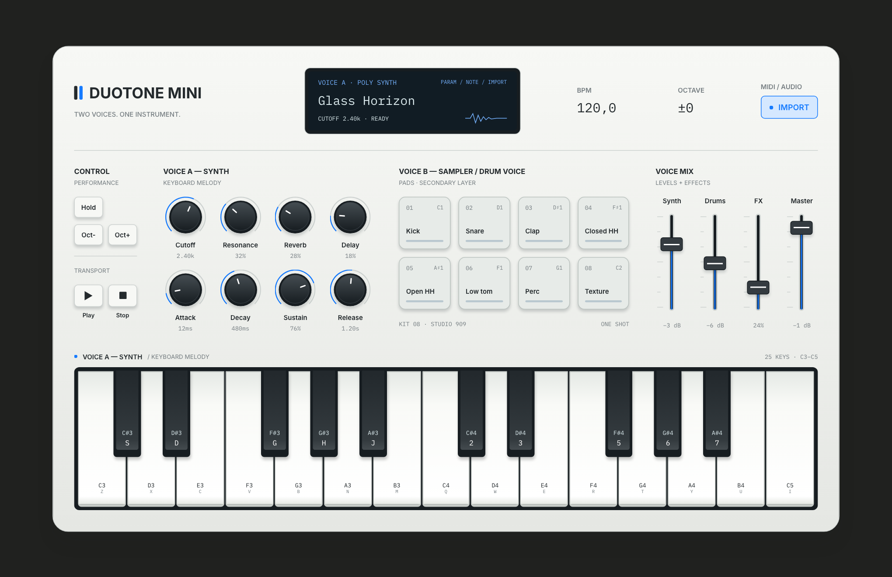
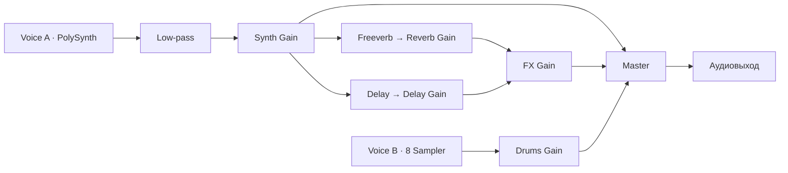

# DUOTONE MINI

**Two voices. One instrument.**

[Live Demo](https://matveyabramov.github.io/duotone-mini/) · [Figma](https://www.figma.com/design/KXUjSvnHLI06RCqXclXBwo/Synth?node-id=0-3) · [Performance Screencast](https://kinescope.io/rD1xFy4eTP4Q2j5CkoYqp6) · [GitHub](https://github.com/matveyabramov/duotone-mini)



## 01 — О проекте

DUOTONE MINI — браузерный музыкальный инструмент, объединяющий **полифонический синтезатор и сэмплерные ударные**. Учебный проект для НИУ ВШЭ соединяет UX/UI-дизайн, программирование звука и музыкальное исполнение: на одной панели можно играть аккорды, запускать ритм, импортировать MIDI и менять тембр в реальном времени.

Два голоса отвечают за разные способы построения музыки. **Voice A** задаёт мелодию, гармонию и длительность нот; **Voice B** добавляет ритм и отдельные акценты. Их независимость позволяет менять характер синтезатора, сохраняя звук барабанов, и собирать из двух слоёв общую композицию через микшер.

Визуальный ориентир — компактные аппаратные MIDI-контроллеры, особенно **Arturia MiniLab 3**. От них заимствована логика панели: клавиатура внизу, пэды и поворотные регуляторы над ней, небольшой дисплей рядом с управлением исполнением. В браузере эта структура дополнена значениями параметров и подписями компьютерных клавиш. Проект интерпретирует аппаратную эстетику, сохраняя удобство экранного взаимодействия.

Инструмент рассчитан на исполнение, в котором заранее подготовленная мелодия становится основой для живой работы со звуком. Исполнитель может оставить MIDI играть, добавить ударные вручную и постепенно раскрывать тембр фильтром и эффектами. Компактная панель позволяет видеть эти действия вместе и связывать изменение параметра с музыкальным результатом.

## 02 — Принцип работы

Звук активируется первым нажатием клавиши, пэда или Play. Дальше доступны три способа работы: ручная игра, автоматическое воспроизведение и их сочетание.

**Voice A — клавиатура.** 25 клавиш с исходным диапазоном C3–C5 поддерживают мелодию и аккорды. Играть можно мышью, касанием или клавиатурой компьютера. Без Hold нота удерживается до отпускания, затем затухает по Release. Режим Hold фиксирует отдельные высоты: повторное нажатие снимает выбранную ноту, выключение режима — все фиксации. Так можно удерживать аккорд и одновременно работать с регуляторами.

Компьютерная раскладка идёт по полутонам: нижняя октава — `Z S X D C V G B H N J M`, верхняя с завершающей C5 — `Q 2 W 3 E R 5 T 6 Y 7 U I`. Подписи видны на клавишах; привязка следует физическим позициям и сохраняется при смене языка. Oct− / Oct+ сдвигают диапазон на ±2 октавы, сохраняя высоту уже звучащих нот.

**Voice B — пэды.** Восемь пэдов запускают бас-барабан, малый барабан, хлопок, закрытый и открытый хай-хэт, низкий том, римшот и крэш-тарелку. Каждый звук проигрывается как one-shot: отпускание пэда не обрывает запись. Hold и октавный сдвиг на барабаны не влияют. Пэд в фокусе также можно запускать через Space / Enter.

**Play / Stop и BPM.** Play включает повторяющийся ритм: Kick на долях 1 и 3, Snare на 2 и 4, закрытый хай-хэт на каждой восьмой. Поле BPM меняет скорость исполнения; начальный темп — 120, обычный диапазон — 50–200. Stop возвращает транспорт к началу и снимает ноты, сохраняя параметры и загруженный MIDI. Потеря фокуса окна также останавливает исполнение.

**MIDI-импорт.** IMPORT принимает `.mid` / `.midi` и выбирает одну мелодическую дорожку с наибольшим числом нот. Play исполняет её один раз вместе с барабанным циклом; барабаны продолжаются до Stop. Используется начальный темп файла, который можно изменить в BPM. MIDI звучит через тот же Voice A, поэтому настройки фильтра, огибающей и эффектов работают и для последовательности. Импорт WAV/MP3 пока не реализован.

**Изменение параметров.** Регуляторы реагируют на перетаскивание вверх/вправо и вниз/влево; в фокусе работают стрелки, Home и End. Четыре фейдера управляют Synth, Drums, FX и Master. Во время автоматического воспроизведения ручные клавиши, пэды и регуляторы остаются доступны.

## 03 — Звуковая архитектура

Voice A реализован через **`Tone.PolySynth(Tone.Synth)` с полифонией до 32 голосов**. Осциллятор каждого голоса настроен на пилообразную волну **sawtooth**; амплитудная огибающая ADSR задаёт развитие ноты. Ручная игра и MIDI используют один синтезатор, причём MIDI передаёт длительность и velocity своих нот.

Общий low-pass-фильтр `Tone.Filter` со спадом −24 dB/октаву формирует яркость тембра. Cutoff ограничивает верхние частоты, Resonance подчёркивает область среза. Далее Synth Gain регулирует уровень сигнала перед его разделением на сухой звук и две параллельные ветви эффектов.

| Параметр | Начальное значение | Диапазон |
| --- | --- | --- |
| Cutoff | 2400 Гц | 80–16 000 Гц |
| Resonance | 32% | 0–100%, Q 0,5–8 |
| Attack / Decay | 12 / 480 мс | 2 мс–2 с / 20 мс–3 с |
| Sustain / Release | 76% / 1,2 с | 0–100% / 30 мс–6 с |
| Reverb / Delay | 28% / 18% | 0–100% уровня каждого возврата |

Частота среза и времена огибающей используют логарифмические шкалы. Они позволяют точнее работать с короткими атаками и низкими частотами, сохраняя доступ к широкому диапазону значений.

**`Tone.Freeverb`** создаёт пространство (`roomSize = 0.72`, `dampening = 4500` Гц), **`Tone.FeedbackDelay`** — повторения с задержкой 250 мс и feedback 28%. Задержка фиксирована в секундах и не привязана к BPM. Оба эффекта настроены на `wet = 1`; ручки Reverb и Delay регулируют уровни их возвратов, а FX — общий уровень обработанного сигнала. Эффекты работают параллельно и суммируются с сухим звуком в Master.



Voice B использует **восемь отдельных `Tone.Sampler`** с локальными WAV-записями TR-909 из курса преподавателя. Сэмплы загружаются по требованию и запускаются на исходной высоте. Их сигнал проходит через Drums Gain прямо в Master, независимо от фильтра, огибающей и эффектов синтезатора.

Микшер собирает оба слоя и эффекты в общий выход. Фейдер Synth меняет сухой звук и вход в эффекты, Drums — все ручные и автоматические удары, FX — возвраты, Master — итоговую громкость. Нижнее положение фейдера полностью заглушает соответствующий канал. Изменения gain, cutoff и резонанса сглаживаются за 25 мс; огибающая обновляется через настройки синтезатора.

Барабанный цикл построен на `Tone.Sequence`, мелодия MIDI — на `Tone.Part`. Оба расписания используют общий транспорт, а `Tone.getDraw()` связывает подсветку с аудиовременем. Подробные настройки, маршрутизация, ограничения MIDI и проверки вынесены в [техническую документацию](docs/technical.md).

## 04 — Интерфейс и дизайн

Дизайн построен вокруг **одного основного экрана**: [макет в Figma](https://www.figma.com/design/KXUjSvnHLI06RCqXclXBwo/Synth?node-id=0-3). Светлый корпус с мягким градиентом, скруглениями и разделительными швами создаёт ощущение компактного прибора на тёмном фоне. Электрический синий `#167bff` выделяет действия и активные состояния. Inter используется для подписей, IBM Plex Mono — для дисплея, чисел и нот.

Верхний блок объединяет OLED-подобный дисплей, темп, октаву и импорт. Центральная часть разделена на управление исполнением, Voice A, Voice B и микшер; клавиатура занимает нижнюю часть. Восемь регуляторов, восемь пэдов и четыре фейдера различаются формой, масштабом и характером взаимодействия, чтобы их назначение читалось ещё до изучения подписей.

Обратная связь поддерживает исполнение: клавиши отражают ручные и MIDI-ноты, Hold показывает фиксацию, Play — работающий транспорт. Пэды кратко вспыхивают при ударе и возвращаются в нейтральное состояние. Дисплей показывает выбранный параметр, ноту или результат импорта; клавиатурный фокус выделен отдельной обводкой.

Графика волны на дисплее служит визуальным элементом, а полосы фейдеров показывают установленный уровень. На узких экранах секции перестраиваются, клавиатура прокручивается горизонтально. Основной визуал в начале README — скриншот работающего интерфейса.

## 05 — Музыкальное высказывание

**Glass Horizon** — авторская композиция длительностью около **двух минут** в темпе **96 BPM**. Её форма развивается от атмосферного вступления через основную тему и контрастный раздел к брейку, кульминации и аутро.

Voice A исполняет подготовленную MIDI-последовательность, Voice B формирует ритмический слой. Живое исполнение строится на изменении cutoff, ADSR, уровней реверберации и задержки, баланса каналов и ручных акцентах на клавишах и пэдах. Вступление раскрывает тембр и пространство, основная тема соединяет мелодию с ритмом, контраст и брейк меняют плотность, кульминация собирает слои, а аутро завершает развитие.

Композиция демонстрирует полифонию, независимость двух голосов и совместную работу автоматического воспроизведения с ручной игрой. Изменения параметров становятся частью музыкальной формы: один и тот же материал может звучать мягко и отдалённо или ярко и плотно. Для исполнения используется 96 BPM; начальное значение приложения — 120 BPM.

[**Смотреть исполнение Glass Horizon на Kinescope →**](https://kinescope.io/rD1xFy4eTP4Q2j5CkoYqp6)

## 06 — Процесс разработки с ИИ

Проект прошёл путь от концепции до браузерного инструмента через последовательное сочетание AI-инструментов и ручной работы:

1. **ChatGPT** помог сформулировать концепцию, требования к двум голосам, архитектуру, план реализации, музыкальные идеи и подход к проверке.
2. **Figma AI** использовался для первичной генерации интерфейса и дизайн-итераций.
3. **Ручная доработка** уточнила иерархию панели, расположение контролов, подписи клавиатуры и функциональные состояния.
4. **Figma MCP** передал контекст утверждённого макета в разработку.
5. **Codex** реализовал HTML/CSS/JavaScript, интегрировал Tone.js, помог исправить ошибки и проверить взаимодействия.
6. **Human review** связал результат с замыслом: проверка визуального соответствия, звука, логики управления и музыкального исполнения.

Распределение ответственности оставалось явным: дизайнер определял концепцию, выбирал визуальные решения, утверждал изменения и оценивал музыку на слух. AI помогал исследовать варианты, переводить требования в код и проверять реализацию. Переход design → code опирался на утверждённый экран, а функциональные решения — на примеры курса и ограничения [AGENTS.md](AGENTS.md): простой стек и два независимых голоса.

В проекте сохранены проверки раскладки, Hold, октав, загрузки ударных, микшера, транспорта и MIDI. Они помогают оценить поведение инструмента при одновременной работе нескольких источников. Браузерные проверки используют настоящие узлы Tone.js; оценка тембра и выразительности остаётся задачей человека и практического исполнения.

**Репрезентативные задания** — реконструированные краткие формулировки на основе инструкций проекта, а не дословные цитаты исторических диалогов:

- Создать браузерный инструмент на HTML, CSS и JavaScript: полифонический синтезатор на клавиатуре и отдельный сэмплерный голос на восьми пэдах, используя подходы курса Tone.js.
- Сохранить основной экран Figma, его иерархию и утверждённые органы управления; не добавлять новые контролы без согласования дизайна.
- Описать реальную архитектуру, эффекты и MIDI-импорт после изучения кода; отделить работающие возможности от планов развития.

## 07 — Roadmap

**Текущая версия** реализует два независимых слоя, ручную игру и MIDI-воспроизведение, фиксированный барабанный цикл, управление тембром и миксом. Эти возможности составляют основу представленного исполнения.

**Дальнейшее развитие:**

- **Адаптивность:** улучшить компоновку на небольших экранах и удобство мобильного мультитача.
- **Тембры и сэмплы:** добавить выбор волн, расширенные настройки синтезатора и дополнительные звуковые банки.
- **Ритм и аранжировка:** перейти от фиксированного цикла к редактированию шагов, паттернов и структуры партии.
- **MIDI:** расширить выбор дорожек и поддержку карты темпа и управляющих событий.
- **Пользовательский звук:** добавить загрузку WAV/MP3 с назначением на пэды.
- **Визуализация:** отображать реальный аудиосигнал и измерять текущие уровни.
- **Исполнение:** улучшить отклик, обратную связь и устойчивость взаимодействий.

Эти пункты относятся к будущим версиям. Новые функции потребуют согласованного развития интерфейса, чтобы сохранить компактность и ясное разделение двух голосов.

## 08 — Технологии и ссылки

**Стек:** HTML, CSS, JavaScript, **Tone.js 15.1.22** и **@tonejs/midi**. Библиотеки, WAV, SVG и шрифты включены локально; фреймворки, сборка и установка npm-зависимостей не требуются. MIDI обрабатывается в браузере.

Для локального запуска из корня проекта нужны Python 3 и браузер с Web Audio:

```sh
python3 -m http.server 8000 --bind 127.0.0.1
```

Откройте [localhost:8000](http://127.0.0.1:8000) и нажмите клавишу, пэд или Play. Проверка логики при наличии Node.js: `node tests/phase1.test.js`. Браузерные аудиопроверки, структура файлов и технические подробности описаны в [docs/technical.md](docs/technical.md); происхождение записей — в [assets/audio/README.md](assets/audio/README.md).

**Материалы проекта:** [Live Demo](https://matveyabramov.github.io/duotone-mini/) · [Figma](https://www.figma.com/design/KXUjSvnHLI06RCqXclXBwo/Synth?node-id=0-3) · [Kinescope](https://kinescope.io/rD1xFy4eTP4Q2j5CkoYqp6) · [GitHub](https://github.com/matveyabramov/duotone-mini).

**Учебные ориентиры:** [курс ADC-GID-26-27](https://github.com/ZakharDay/ADC-GID-26-27), [примеры Synth Controls](https://zakharday.github.io/synth-controls/), [бойлерплейт без Bun](https://github.com/ZakharDay/ADC-GID-Synth-No-Bun) и [альтернативный бойлерплейт курса](https://github.com/ZakharDay/ADC-GID-boilerplate). Текущий проект использует простой статический запуск без Bun.
